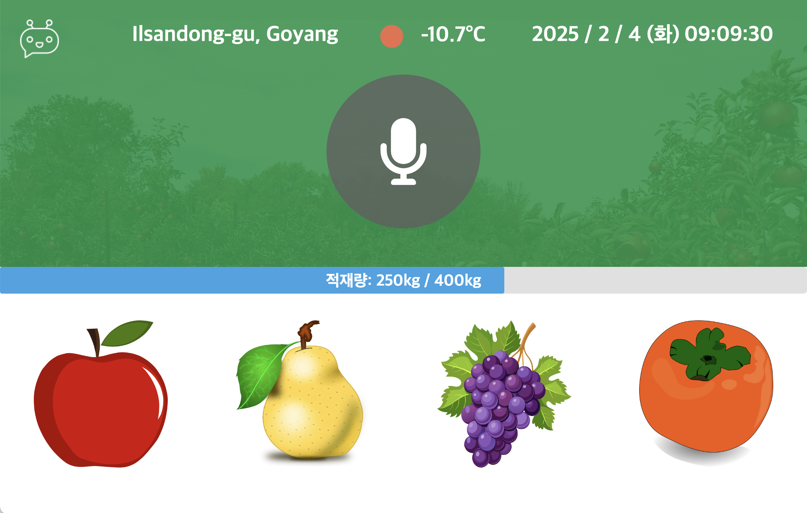
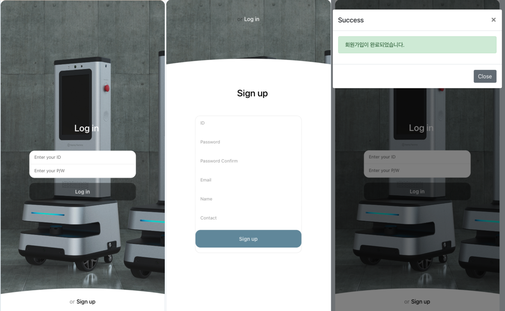
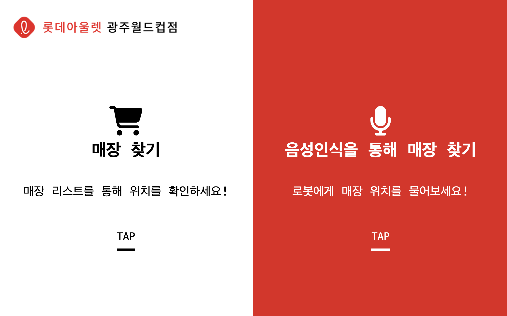
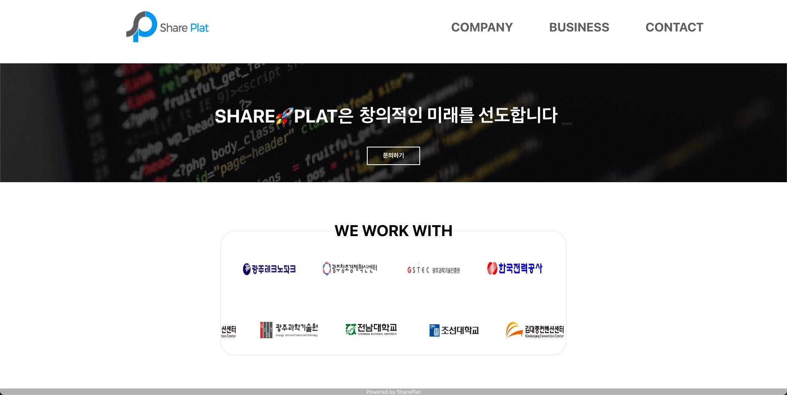
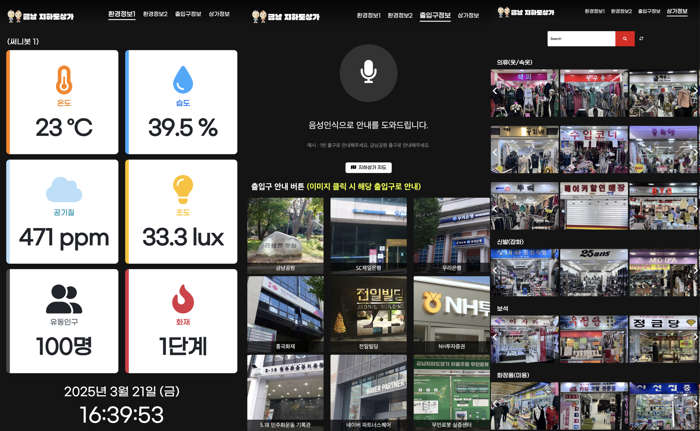

  

<section id="profile">
  <h2>🧑‍💻 PROFILE</h2>
  <ul>
    <li><strong>Name</strong> 김성욱</li>
    <li><strong>Birth</strong> 1998.09.01</li>
    <li><strong>Mail</strong> <a href="mailto:tjddnr9893@naver.com">tjddnr9893@naver.com</a></li>
  </ul>
</section>

---

<section id="skills">
  <h2>🚀 SKILLS</h2>

  <!-- 언어 -->
  

    <h3 style="display: flex; align-items: center;">
      
      
      
      
    </h3>
  

  <!-- 라이브러리 & 프레임워크 -->
  

    <h3 style="display: flex; align-items: center;">
      
      
      
      
    </h3>
  

  <!-- 데이터베이스 -->
  

    <h3 style="display: flex; align-items: center;">
      
      
    </h3>
  

  <!-- 배포 환경 -->
  

    <h3 style="display: flex; align-items: center;">
      
      
    </h3>
  

</section>

---

<section id="certificate">
  <h2>📜 CERTIFICATE</h2>
  <ul>
    <li><strong>2022.11</strong> 정보처리기사  
      <small> 한국산업인력공단</small>
    </li>
    <li><strong>2023.07</strong> 빅데이터분석기사  
      <small> 한국데이터산업진흥원</small>
    </li>
    <li><strong>2023.06</strong> 데이터분석준전문가(Adsp)  
      <small> 한국데이터산업진흥원</small>
    </li>
    <li><strong>2023.06</strong> AICE(Associate)  
      <small> KT, 한국경제신문</small>
    </li>
  </ul>
</section>

---

<section id="awards">
  <h2>🏆 AWARDS</h2>
  <ul>
    <li><strong>2024.05</strong> 금융 데이터 활용 아이디어 경진대회 장려상
      <small> 전북창조경제혁신센터</small>
    </li>
  </ul>
</section>

---

<section id="education">
  <h2>🎓 EDUCATION</h2>
  <ul>
    <li><strong>2023.02 ~ 2023.08</strong> KT AIVLE SCHOOL DX컨설턴트 3기 수료</li>
  </ul>
</section>

---

<section id="experience">
  <h2>💼 EXPERIENCE</h2>
  <ul>
    <li>
      <strong>써니팩토리 (2023/12 ~ )</strong> - 풀스택 개발자
      <ul>
       
        <li>Flask 기반 RESTful API 서버 설계 및 개발</li>
        <li>Vue.js를 활용한 웹 프론트엔드 구현 및 유지보수</li>
        <li>MySQL 기반 데이터베이스 설계, 인덱스 최적화 및 쿼리 튜닝</li>
        <li>AWS EC2, S3를 활용한 배포 및 서버 인프라 운영</li>
        <li>Google STT 및 TTS API를 활용한 음성인식 기반 서비스 개발</li>
      </ul>
    </li>
    <li>
      <strong>코넥시오에이치 (2023/08 ~ 2023/11, 인턴)</strong> - 데이터 분석
      <ul>
       
        <li>Python 및 Pandas를 활용한 데이터 분석</li>
        <li>해외 온라인 쇼핑몰 리서치 및 데이터 수집</li>
        <li>내부 데이터(카테고리) 표준화 DB 구축을 목표로 하는 작업에서 내부 데이터를 전처리 하여 표준화 작업 진행</li>
      </ul>
    </li>
  </ul>
</section>

---

<section id="project">
  <h2>🖥️ PROJECTS</h2>
  <h3>이미지 클릭시 해당 프로젝트 깃허브로 이동</h3>

  

    <h3>📌 프로젝트 1 - AI기반 객체인식 활용 자율주행 과수운반 로봇 WEB</h3>
    
    
<strong>📅 </strong> 2024.10 ~ 2024.12

    
<strong>🛠 </strong> Python, Flask, MySQL, Node.js

    
<strong>💡 </strong> 자율주행 운반 로봇 화면 개발

  

  

    <h3>📌 프로젝트 2 - 무인의류매장 플랫폼 운영 위한, AI 기반 매장 안내 점원 로봇 WEB</h3>
    
    
<strong>📅 </strong> 2024.08 ~ 2024.10

    
<strong>🛠 </strong> VUE.JS, HTML, CSS, MySQL, Node.js

    
<strong>💡 </strong> Vue.js 기반 무인매장 내 쇼핑 도우미 웹 화면 개발

  

  

    <h3>📌 프로젝트 3 - 무인의류매장 플랫폼 운영 위한, AI 기반 매장 사용자 QR CHECK-IN</h3>
    
    
<strong>📅 </strong> 2024.08 ~ 2024.10

    
<strong>🛠 </strong> PYTHON, HTML, CSS, JS, FLASK, MYSQL, DJANGO

    
<strong>💡 </strong> 회원가입 및 로그인 절차를 통한 무인매장 출입 QR 코드 발급 서비스 화면 개발

  

  

    <h3>📌 프로젝트 4 - 롯데아울렛 자율주행(안내) 점원 무인로봇 WEB</h3>
    
    
<strong>📅 </strong> 2024.04 ~ 2024.08

    
<strong>🛠 </strong> PYTHON, HTML, CSS, JS, FLASK, MYSQL, NODE.JS, DJANGO

    
<strong>💡 </strong> 매장 이용객 및 방문 고객 안내 및 음성인식 기반 로봇 화면 개발

  

  

    <h3>📌 프로젝트 5 - (주)쉐어플랫 홈페이지 제작</h3>
    
    
<strong>📅 </strong> 2024.03 ~ 2024.04

    
<strong>🛠 </strong> PYTHON, HTML, CSS, JS, FLASK, NODE.JS

    
<strong>💡 </strong> Flask 기반 회사 홈페이지 개발

  

  

    <h3>📌 프로젝트 6 - 금남지하상가 자율주행 로봇 WEB</h3>
    
    
<strong>📅 </strong> 2023.12 ~ 2024.03

    
<strong>🛠 </strong> PYTHON, HTML, CSS, JS, FLASK, MYSQL, NODE.JS

    
<strong>💡 </strong> 광주에 위치한 금남지하도상가의 센싱정보와 상가정보, 출입구정보 제공 서비스 화면 개발

  

</section>

---

<button id="topButton">TOP ⬆</button>

